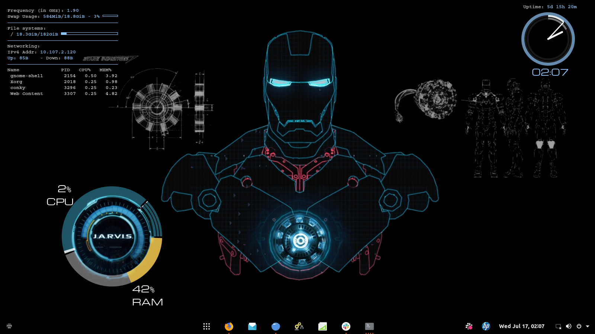

# conky-configs
configurations for my conky theme for desktop


## Installations

sudo apt-get install conky-all

## bringing up conky monitors 
each of the conkyrc files have seperate uses
.conkyrc.lua - draws system information on top_left corner
.conkyrc_jarvis.lua - draws CPU and ram information over jarvis in background
    it requires jarvis.lua to work. (jarvis.lua is called from .conkyrc_jarvis.lua check lua_load variable and correct the path)
    
.conkyrc_clock.lua -draws clock in right top
    requires clock_handles.lua to work (check lua_load variable in .conkyrc_clock.lua) and correct the path 
    
 ```
 conky -d -c .conkyrc.lua
 conky -d -c .conkyrc_jarvis.lua
 conky -d -c .conkyrc_clock.lua
 ```
 -d switch force conky to run as a background process 
 To kill all the conky processes. use 
 
 ```
 killall conky
 ```
    
 ### dependencies 
 
 Font family used is Michroma you need to have this installed. Else you can edit .conkrc*.lua files to change the font
 Dont forget to change the ethernet name for displaying Uplink downlink. Use 
 ``` ip a ``` to find out the name of your network adapter . mine was enp3s0
    
 This project is inspired from  [conky-dashboard project](https://github.com/He4eT/conky-dashboard.git)
 
 # System theme settings
 Uses gnome-tweaks 
 Theme Telinkrin-Buttons-Left
 Cursor DMZ-Black
 Icons Tela
 
 `Dash to Panel` extension for changing the position of dash
 
 Desktop show Icons set to off in gnome-tweaks
 
